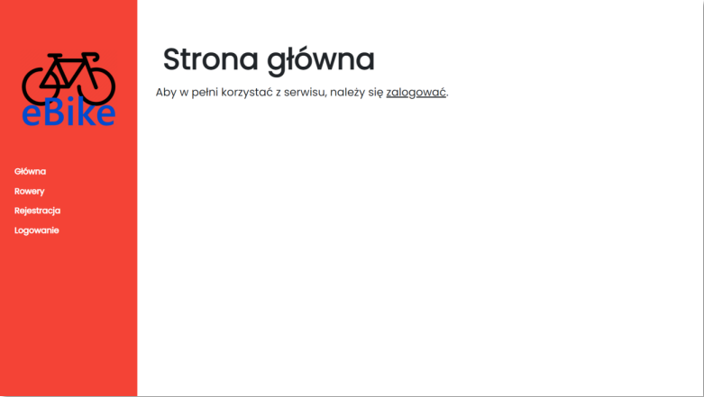
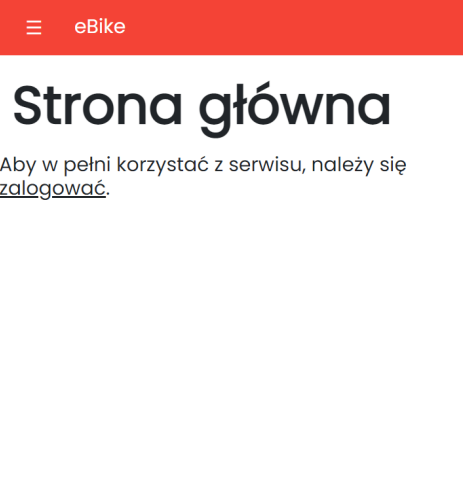
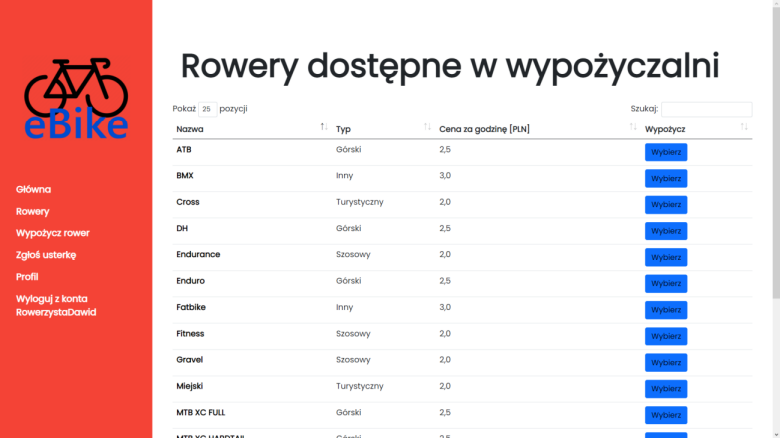
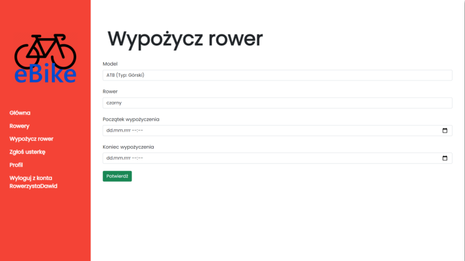
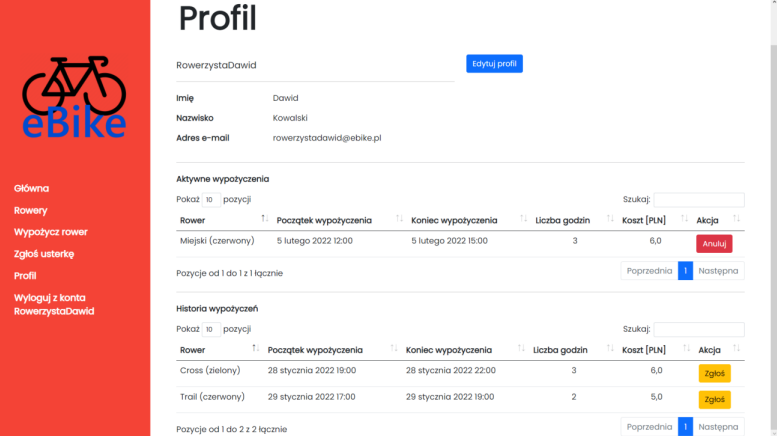
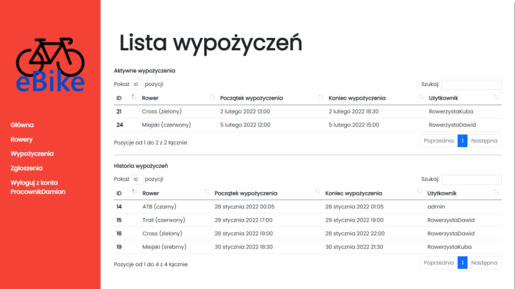
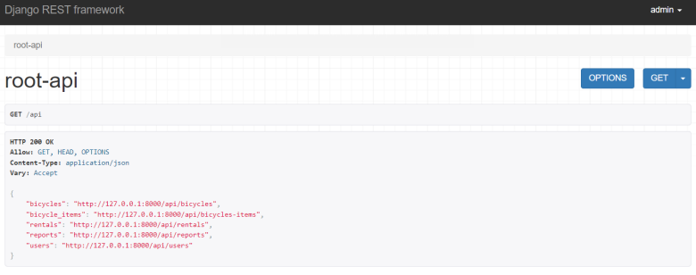

*This is an upload/archive of my older project.*

A Django project of a bicycle rental service app.

Main technologies used:
- Python 3.10
- Django
- Django REST Framework
- HTML
- CSS
- Bootstrap
- W3.CSS
- JavaScript
- JQuery
- MySQL

Sample Screenshots:

